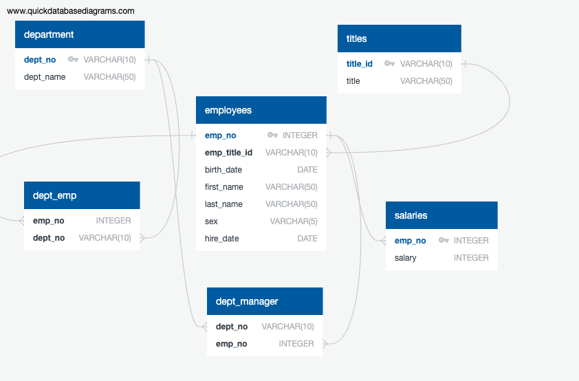

# ds_hw_9_sql

## Homework for Module 9 - SQL

In this assignment, I used [QuickDBD](https://www.quickdatabasediagrams.com/) to design an Entity Relationship Diagram. Using this tool, I was able to generate a schema for a PostgreSQL database. I was then able to load data into the database and query it.

## Submission

[Schema](EmployeeSql/schema.sql)

[Queries](EmployeeSQL/queries.sql)
